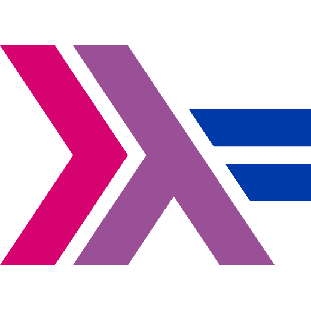

# Haskell pride logo

Various pride flags adapted into haskell logo.

<table style="text-align: center">
  <tr>
    <td>
       
      Prideskell
    </td>
    <td>
       
      Hasbian
    </td>
    <td>
       
      Hasgay/Haskemlm
    </td>
  </tr>
  <tr>
    <td>
       
      Biskell
    </td>
    <td>
       
      Panskell
    </td>
    <td>
       
      Haskellfluid
    </td>
  </tr>
  <tr>
    <td>
       
      Aceskell
    </td>
    <td>
       
      Enbiskell/NBskell
    </td>
    <td>
       
      Transkell
    </td>
  </tr>
  <tr>
    <td>
       
      Interskell
    </td>
    <td>
       
      Aroskell
    </td>
    <td>
       
      Agender
    </td>
  </tr>
</table>

Acknowledgement to [Slavfox] for making transkell.

[slavfox]: https://github.com/slavfox
